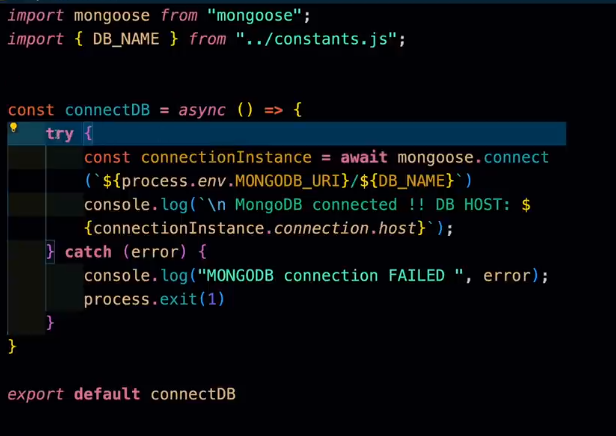
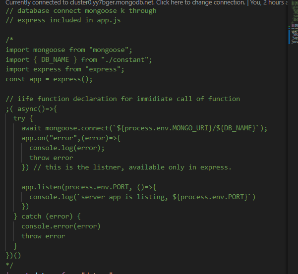
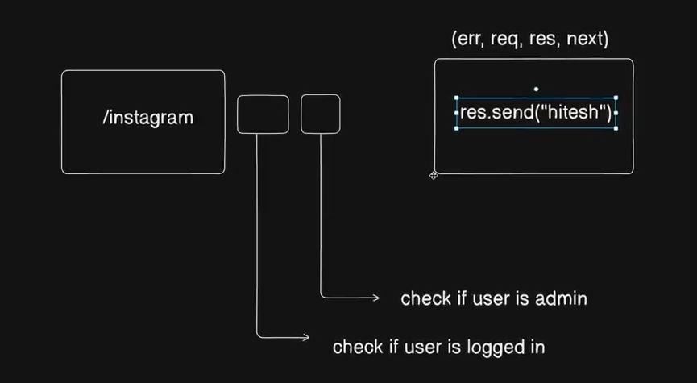
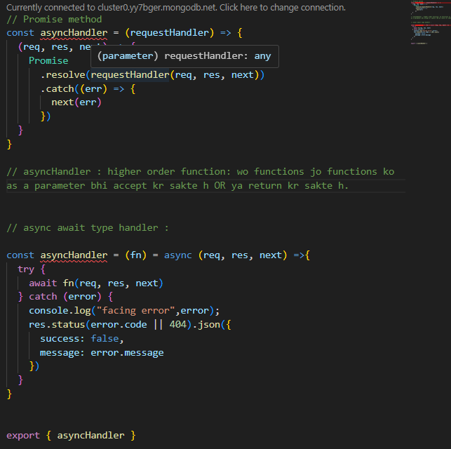
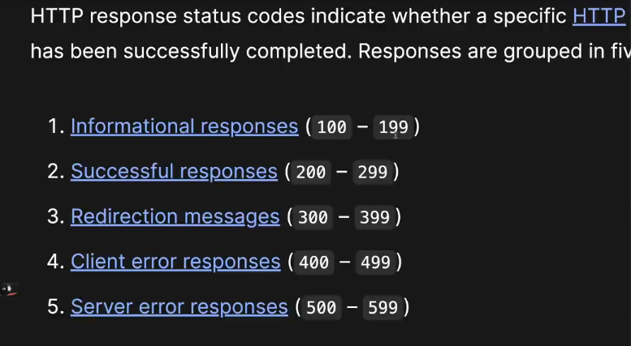

# youtube backend

- git status: is the command to know which files are updated for the commit
<!-- Setup zone -->
- [data model](https://app.eraser.io/workspace/YtPqZ1VogxGy1jzIDkzj)

- Database connection : mongoDB atlas search in google.
    Use shared database in mongodb atlas.

    1. whenever you try to contact with database always use try catch OR promise. 
    2.Database is always in another continent.REMEMBER. means it takes time to contact database so always use ASYNC & AWAIT.

- env variable experimental and direct loading in our application with nodemon : 
  "scripts": {
    "dev": "nodemon -r dotenv/config src/index.js"
  },

  ------------  -r dotenv/config ------------ by this

- MongoDB is connected via db folder, as well as, index.js file commented code. 

- IIFE function is used in index.js file which is used to immidiately call the function. 

- NOTE : whenever you change anything in the env variable u need to restart the nodemon as it will not read that. 

- NOTE : while debugging always try to start debug with import statements and then the use of import variable in that file.

- custom error and custom api response classes:
  Async method whenever calls, returns PROMISE as mandatory.

- mongoDB connect method : 
  1. connect MongoDB
  2. always write the code in try and catch & async-await at the time of connection because your server is at different continent so it takes time to listen. 
  3. once connected, use express to allow app to listen the server. whenever the async await function calls, it returns PROMISE in the form of then() and catch() function.
  4. we can also use the power of app.on(callback_function)

- types to define mongodb : 

&&

# cors 
NOTE : <!-- express documentation for request and response different types --> || <!-- CORS and cookie parser IMP package to handle -->
1. read about whitelisting.
2. read about the parameters we can pass in the cors function.
- app.use(cors({ origin: *, <!-- other options should available here --> }))

# cookie parser
- used to read the cookies of the customer browser with the help of server or set the cookies. CRUD on cookies

# express
- data comes from: 
  1. body
  2. jsonData
  3. form 
  4. param  
  5. file (multer)

- what are extended urlencoded in express

- app.use(express.json({limit:"10kb"})) : LIMITING THE JSON FILE
- app.use(express.urlencoded({extended:true, limit:"10kb"})) <!-- is used to read the url which is encoded with + OR %, URL has its own encoder so to decode that we need to tell express to understand this encoding  -->
- app.use(express.static("anmol_public")) <!-- is used to store static files like images  --> 

# middleware 
 

# higher order function declaration: 

- to standardise the practice of error and response : means make the format similar for both error and response: !nodejs api error
  1. Status codes : 

# Main data of index.js
- Main file : index.js
- configuration of cors. USE method is used for the middleware invoking.
  1. app.use(cors()) [ we can apply condition on cors as well ]
